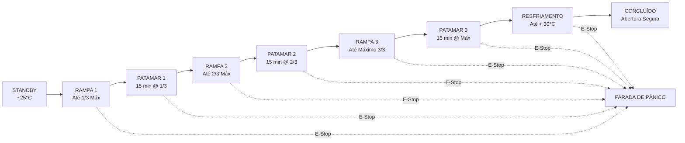

# 🔥 TERMO-KILN SCADA 4.0 | IHM de Controle Térmico Cerâmico

<div align="center">


**Interface Homem-Máquina (IHM / SCADA 4.0) para automação, monitoramento e controle de queima cerâmica com rampas e patamares térmicos.**

[Visualizar Demonstração](#-como-executar) • [Recursos](#-recursos-e-funcionalidades) • [Lógica de Controle](#-lógica-do-processo-térmico) • [Estrutura](#-estrutura-do-projeto) • [Requisitos](#-requisitos-atendidos)

</div>

---

## 📖 Visão Geral

O **TERMO-KILN SCADA 4.0** é uma IHM (Interface Homem-Máquina) de alto padrão desenvolvida em **HTML5, CSS3 e JavaScript Vanilla puro** (sem frameworks), simulando a instrumentação, telemetria e o controle térmico avançado de fornos cerâmicos industriais / termocaldeiras 4.0 da **Águia Engenharia**.

O sistema implementa o ciclo industrial completo de sinterização e queima cerâmica através de rampas térmicas automatizadas, patamares de estabilização térmica por terços de temperatura, resfriamento seguro, intertravamentos de segurança e supervisão gráfica em tempo real.

---

## ✨ Recursos e Funcionalidades

### 🎛️ 1. Painel de Controle e Parâmetros de Queima
- **Ajuste Dinâmico de Temperatura:** Sliders e entradas numéricas sincronizadas para Temperatura de Arranque (1º Terço) e Temperatura Máxima (até 1350 °C).
- **Presets Cerâmicos Pré-definidos:**
  - 🏺 **Biscoito:** 980 °C (Arranque em 400 °C)
  - 🎨 **Faiança:** 1050 °C (Arranque em 450 °C)
  - 🧱 **Grés:** 1220 °C (Arranque em 500 °C)
  - ☕ **Porcelana:** 1280 °C (Arranque em 550 °C)
- **Botoeiras Industriais com Feedback Luminoso (LEDs):**
  - Botão **LIGAR / INICIAR** com LED verde indicador.
  - Botão **PAUSAR / RETOMAR** com LED âmbar.
  - Botão de **PÂNICO / E-STOP (Parada de Emergência):** Botão cogumelo com trava de corte instantâneo e sirene de emergência.

### 📊 2. Telemetria e Instrumentação em Tempo Real
- **Display Digital Principal:** Leitura em tempo real da temperatura do termopar Tipo K com barra de progresso visual.
- **Métricas de Processo:**
  - Setpoint Alvo (°C)
  - Taxa Térmica Instantânea (°C/min)
  - Potência modulada das Resistências elétricas (0 a 100%)
  - Temporizador do Patamar Ativo (contagem regressiva)
  - Tempo Total Decorrido & Tempo Restante Estimado
- **Timeline de Etapas do Ciclo:** Indicadores visuais de estado (Partida, 1º Terço, 2º Terço, Máximo, Resfriamento e Concluído).

### 🎨 3. Câmara Térmica Interativa & Efeitos Visuais
- **Visualização da Câmara de Queima:** Simulação visual da radiação infravermelha/incandescência térmica com variação de cor e intensidade conforme a temperatura aumenta (de 25 °C ambiente até 1350 °C em brasa viva).
- **Resistências e Exaustão:** Indicadores de estado para resistências ligadas e ventilação/exaustão ativa.

### 📈 4. Curva Térmica Gráfica e Registro de Eventos (SCADA)
- **Gráfico Dinâmico Linear (Chart.js):** Comparação em tempo real entre o **Setpoint Teórico** (linha tracejada) e a **Temperatura Real Medida** (linha contínua com gradiente térmico).
- **Log de Eventos & Telemetria:** Console estilo terminal com timestamp registrando transições de etapas, disparos de alarmes, ajustes de parâmetros e status operacional.

### 🔊 5. Sintetizador de Áudio Industrial (Web Audio API)
- Efeitos sonoros gerados por síntese de áudio (sem necessidade de arquivos de áudio externos):
  - *Click*: Feedback tátil dos botões.
  - *Phase Alert*: Alarme de mudança de patamar/etapa.
  - *Emergency Siren*: Alarme oscilatório de parada de emergência (E-Stop).
  - *Completion Chime*: Notificação harmônica de processo concluído com segurança.
  - Botão no cabeçalho para ativar/mutar áudio.

### ⚡ 6. Acelerador de Simulação (Modo de Teste)
- Multiplicadores de velocidade para validação ágil:
  - **1x Real**
  - **10x**
  - **30x**
  - **60x (Padrão):** 1 minuto virtual = 1 segundo real (ciclos de teste rápidos)
  - **120x**

---

## 🔄 Lógica do Processo Térmico

O ciclo térmico é executado de acordo com as seguintes fases automáticas:



1. **Rampa 1 (Partida até 1/3 Máx):** Aquecimento gradual para eliminação de umidade física residual.
2. **Patamar 1 (15 minutos):** Homogeneização térmica e evaporação completa.
3. **Rampa 2 (1/3 até 2/3 Máx):** Aquecimento para queima de matéria orgânica e decomposição química.
4. **Patamar 2 (15 minutos):** Estabilização para evitar tensões e deformações na cerâmica.
5. **Rampa 3 (2/3 até Máximo):** Elevação até o ponto máximo de vitrificação e sinterização.
6. **Patamar 3 (15 minutos):** Maturação e brilho do vidrado cerâmico.
7. **Resfriamento Seguro:** Descida suave e contínua até temperatura segura inferior a 30 °C.
8. **Conclusão:** Liberação segura para abertura da porta do forno.

---

## 📁 Estrutura do Projeto

```text
App Águia/
├── IHM/
│   ├── index.html        # Estrutura semântica da interface SCADA
│   ├── style.css         # Design system industrial escuro, glassmorphism e animações
│   ├── script.js         # Motor de simulação, máquina de estados, Web Audio e Chart.js
│   └── _instruções.txt   # Especificações e requisitos do desafio
└── README.md             # Documentação do repositório
```

---

## 🚀 Como Executar

Por ter sido construído com tecnologias web nativas (**Vanilla HTML/CSS/JS**), não é necessária nenhuma instalação ou compilação de pacotes.

### Opção 1: Execução Direta
1. Clone este repositório:
   ```bash
   git clone https://github.com/SEU_USUARIO/App-Aguia.git
   ```
2. Navegue até a pasta `IHM/`.
3. Abra o arquivo `index.html` em qualquer navegador web moderno (Google Chrome, Microsoft Edge, Firefox, Brave, Safari).

### Opção 2: Com Servidor Local (Live Server / Python / Node)
- **VS Code:** Clique com o botão direito em `IHM/index.html` e selecione **Open with Live Server**.
- **Python:**
  ```bash
  cd IHM
  python -m http.server 8080
  ```
  Acesse `http://localhost:8080` no seu navegador.

---

## 📋 Requisitos Atendidos

| Requisito | Status | Implementação |
| :--- | :---: | :--- |
| **IHM do Termocaldeira 4.0** | ✅ | Interface completa SCADA com padrões industriais e tema dark moderno. |
| **Barra Superior / Status** | ✅ | Logo Águia Engenharia, título SCADA 4.0, sinalizador de status dinâmico e relógio em tempo real. |
| **Controle de Temperatura** | ✅ | Visualização digital da temperatura atual, setpoint, potência e taxa de rampa. |
| **Controle de Tempo** | ✅ | Contagem regressiva de patamares, tempo total decorrido e tempo estimado. |
| **Controle de Energia** | ✅ | Monitoramento percentual da potência fornecida às resistências térmicas. |
| **Botoeiras de Controle** | ✅ | Iniciar, Pausar, Retomar, Pânico (E-STOP) com intertravamento e Reset. |
| **Controle de Velocidade** | ✅ | Seletores de velocidade de simulação (1x, 10x, 30x, 60x, 120x). |
| **Simulação por Script** | ✅ | Máquina de estados completa em JavaScript puro simulando dinamicamente o comportamento térmico. |
| **Responsivo e Fluido** | ✅ | Layout em CSS Grid/Flexbox moderno com design responsivo e efeitos visuais imersivos. |
| **Sem Frameworks Pesados** | ✅ | Desenvolvido 100% do zero em HTML5, CSS3 e JS puro (com auxílio de Chart.js para o gráfico). |

---

## 🛠️ Tecnologias Utilizadas

- **HTML5:** Semântica estrutural, formulários e acessibilidade.
- **CSS3:** Variáveis CSS (design tokens), tema industrial escuro, efeitos de *glassmorphism*, animações de calor e layout responsivo (*CSS Grid / Flexbox*).
- **JavaScript (ES6+):** Orientação a objetos com `KilnController`, máquina de estados finitos, atualização assíncrona e telemetria.
- **Chart.js:** Renderização vetorial fluida da curva de temperatura com preenchimento em gradiente.
- **Web Audio API:** Sintetizador sonoro digital em tempo real para feedbacks táteis e alarmes sonoros industriais.
- **FontAwesome & Google Fonts:** Ícones temáticos e tipografia técnica (*Orbitron*, *Inter*, *JetBrains Mono*).

---

## 👨‍💻 Autor

Projeto desenvolvido como parte da disciplina de Automação e IHM para o projeto **Termocaldeira 4.0 - Águia Engenharia**.

---

<div align="center">
  <sub>Desenvolvido com foco em excelência visual, precisão térmica e boas práticas de engenharia de software.</sub>
</div>
